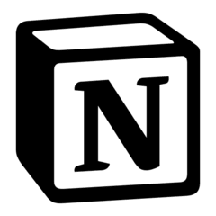

# PyNotion

<div style="text-align: center;">
  <a href="https://pypi.org/project/pynotionclient/"></a>
  <a href="https://github.com/pythonhubdev/PyNotion/commits/main"></a>
  <a href="https://github.com/pythonhubdev/PyNotion/blob/main/LICENSE"></a>
  <a href="https://github.com/Quantivio/PyNotion/actions"></a>
  <a href="https://black.readthedocs.io/en/stable/"></a>
  <a href="https://www.python.org/"></a>
</div>
<br>
<p style="text-align: center;">
  PyNotion is a simple and intuitive Python library for accessing the Notion API. With PyNotion, you can easily integrate and automate Notion tasks within your Python projects.
</p>

<p style="text-align: center;">
  <strong>Please note that PyNotion is currently under development and may not yet be suitable for production use.</strong>
</p>

## Features

PyNotion is currently in development and supports the following features:

1. Create new databases
2. Query existing databases

## Installation

You can install PyNotion using either [Poetry](https://python-poetry.org/) or [pip](https://pypi.org/project/pip/).

### Using Poetry

To install PyNotion using Poetry, run the following command in your terminal:

```bash
poetry add pynotionclient
```

### Using pip

To install PyNotion using pip, run the following command in your terminal:

```bash
pip install pynotionclient
```

## Quick Start

```python
from src.py_notion import PyNotion
from examples.config import base_config
from src.py_notion.schema.database import RichTextFilter, PropertyFilter, Filter, NotionDatabaseResponseSchema

py_notion_client = PyNotion(token=base_config.notion_secret_token)

# Create necessary properties as dictionary
filter_dict = {"page_size": 100, "filter": {"property": "Name", "rich_text": {"contains": "Home"}}}

# Create necessary filter objects from Pydantic models and use them to query the database.

rich_text_filter = RichTextFilter(contains="Game")
property_filter = PropertyFilter(property="Name", rich_text=rich_text_filter)
filter_object = Filter(page_size=100, filter=property_filter)

response_dict_payload: NotionDatabaseResponseSchema = py_notion_client.database.query_database(
        database_id=base_config.database_id, payload=filter_dict
)
response_filter_payload: NotionDatabaseResponseSchema = py_notion_client.database.query_database(
        database_id=base_config.database_id, payload=filter_object
)
```

## Querying a Database

1. Querying a database using a dictionary

```python
from examples.config import base_config
from src.py_notion import PyNotion
from src.py_notion.schema.database import NotionDatabaseResponseSchema

py_notion_client = PyNotion(token=base_config.notion_secret_token)

# Create necessary properties as dictionary
filter_dict = {"page_size": 100, "filter": {"property": "Name", "rich_text": {"contains": "Home"}}}
response_dict_payload: NotionDatabaseResponseSchema = py_notion_client.database.query_database(
 database_id=base_config.database_id, payload=filter_dict
)
```

2. Querying a database using a Pydantic model
```python
from examples.config import base_config
from src.py_notion.schema.database import Filter, NotionDatabaseResponseSchema, PropertyFilter, RichTextFilter
from src.py_notion import PyNotion

py_notion_client = PyNotion(token=base_config.notion_secret_token)

# Create necessary filter objects from Pydantic models and use them to query the database.

rich_text_filter = RichTextFilter(contains="Game")
property_filter = PropertyFilter(property="Name", rich_text=rich_text_filter)
filter_object = Filter(page_size=100, filter=property_filter)

response_filter_payload: NotionDatabaseResponseSchema = py_notion_client.database.query_database(
 database_id=base_config.database_id, payload=filter_object)
```

    #### Response for querying a database
    > PyNotion client gives you the response as a Pydantic model. You can access the response as a dictionary or as a Pydantic model. The response is a NotionDatabaseResponseSchema model which has the following properties: https://developers.notion.com/reference/database

3. Creating a Database

```python
from dotenv import load_dotenv
from src.py_notion import PyNotion
from examples.config import base_config
from src.py_notion.schema.database import (
  ParentConfiguration,
  IconConfiguration,
  TextConfiguration,
  ExternalConfiguration,
  CoverConfiguration,
  SelectOptionsConfiguration,
  SelectOptionsListConfig,
  TitleConfiguration,
  RichTextConfiguration,
  CheckboxConfiguration,
  SelectConfiguration,
  ContentConfiguration,
  MultiSelectConfiguration,
  NumberConfiguration,
  NumberFormats,
  NumberFormatConfiguration,
  DatabasePropertyConfiguration,
)

load_dotenv()
py_notion_client = PyNotion(token=base_config.notion_secret_token)

# # Create database payload
parent_payload = ParentConfiguration(
  type="page_id", page_id=base_config.page_id
)  # The parent is the page where the database will be created.
icon_payload = IconConfiguration(
  type="emoji", emoji="🎮"
)  # The icon is the icon that will be displayed on the database.
text = TextConfiguration(
  content="Game"
)  # The text is the text that will be displayed as the title of the database.
content = ContentConfiguration(
  type="text", plain_text="Game", href="https://www.google.com", text=text
)  # The content has other info's of the title.

# Cover schema
cover = CoverConfiguration(
  type="external", external=ExternalConfiguration(url="https://www.google.com")
)

# # Forming select options schema
properties = {
  "Name": TitleConfiguration().model_dump(),
  "Description": RichTextConfiguration().model_dump(),
  "In stock": CheckboxConfiguration().model_dump(),
  "Food Group": SelectConfiguration(
      select=SelectOptionsListConfig(
          options=[
              SelectOptionsConfiguration(color="green", name="Code"),
              SelectOptionsConfiguration(color="red", name="Game"),
          ],
      )
  ).model_dump(),
  "Cusines": MultiSelectConfiguration(
      multi_select=SelectOptionsListConfig(
          options=[
              SelectOptionsConfiguration(color="green", name="Code"),
              SelectOptionsConfiguration(color="red", name="Game"),
          ],
      )
  ).model_dump(),
  "Price": NumberConfiguration(
      number=NumberFormatConfiguration(
          format=NumberFormats.NUMBER_WITH_COMMAS,
      ),
  ).model_dump(),
}
print(properties)
create_database_payload = DatabasePropertyConfiguration(
  title=[content],
  cover=cover,
  parent=parent_payload,
  icon=icon_payload,
  properties=properties,
)

response = py_notion_client.database.create_database(
  payload=create_database_payload,
)

print(response.json())
```


# PyNotion Development Setup
Follow these steps to set up your development environment for PyNotion:

## Virtual Environment with Poetry
1. Create a fork of the PyNotion repository
2. Clone the repository to your local machine: `git clone git@github.com:<username>/PyNotion.git`
3. Install UV package manager based on your OS:
      - Windows: powershell -c "irm https://astral.sh/uv/install.ps1 | iex"
      - MacOS: curl -LsSf https://astral.sh/uv/install.sh | sh
4. Navigate to the root of the project and run: `uv sync`

## Pre-commit Hooks
1. Install pre-commit hooks: `pre-commit install`
2. Migrate pre-commit configurations: `pre-commit migrate-config`
3. If you encounter an error, run: `git config --global --unset-all core.hooksPath or git config --unset-all core.hooksPath`

## Contributing
We welcome contributions to PyNotion! Before making a major change, please open an issue to discuss your proposed changes. To submit a contribution, simply create a pull request.
